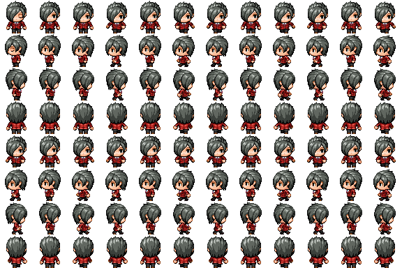
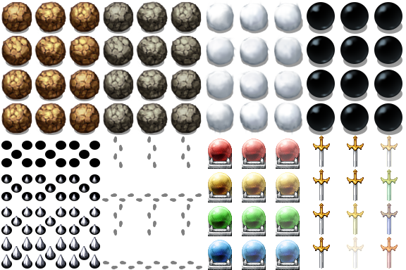

[컨셉](#컨셉)  
[관련 이미지, 동영상](#관련-소스)  
[구성요소](#구성-요소)   
[게임 오브젝트](#오브젝트)

# 컨셉
## 메인컨셉
- 추리, 스토리 게임
- 직접 주인공이 되어 사건을 해결하고 범인을 찾는다

### 서브컨셉 : 타임리프
- 이유 모를 시간 역행에 관해 추리하며 사건을 해결한다
- 숨겨진 아이템, 퍼즐 등 다양한 매개채를 통해 힌트를 얻는다

### 서브컨셉 : 선택지에 따른 이야기의 변화
- 글과 그림으로 스토리를 나열해 나가며 중간 중간 어떤 선택을 하느냐에 따라 스토리가 바뀐다

### 서브컨셉 : SF, 추리
- 시간을 이동한다는 공상과학적 소재를 사용함
- 주인공을 중심으로 사건이 벌어지고 해결하는 추리적 요소 존재

  
# 관련 소스

## [동영상](https://www.youtube.com/watch?v=QvSF8n5oi2w)

  
# [대표 이미지]

  
# 구성 요소

##  메커니즘
- 직접 주인공이 되어 사건을 해결하고 범인을 찾는다
- 추리에 실패하거나 함정에 걸릴 시 플레이어는 사망

 

## 재미요소
- 여러 가지 미니 게임을 통해 사건의 힌트를 얻을 수 있음
- 미션 성공 / 실패에 따른 이벤트 발생
 예) 잠겨진 방의 열쇠를 얻거나 체력이 깎임

 

## 미적요소
- 2D 도트 그래픽을 이용한 맵 구성
 예) 울창한 숲, 어두운 묘지 등
- 주인공 등 여러 캐릭터의 일러스트를 직접 그림
- 장소에 따른 배경음, 상황에 맞는 효과음 삽입
 예) 매미 우는 소리, 음산한 바람 소리, 폭발음 등  

# 오브젝트

연번 | 오브젝트 이름 | 오브젝트 이미지
---- | ---- | ----
1 |주인공| 
2 |맵|
3 |함정| 
